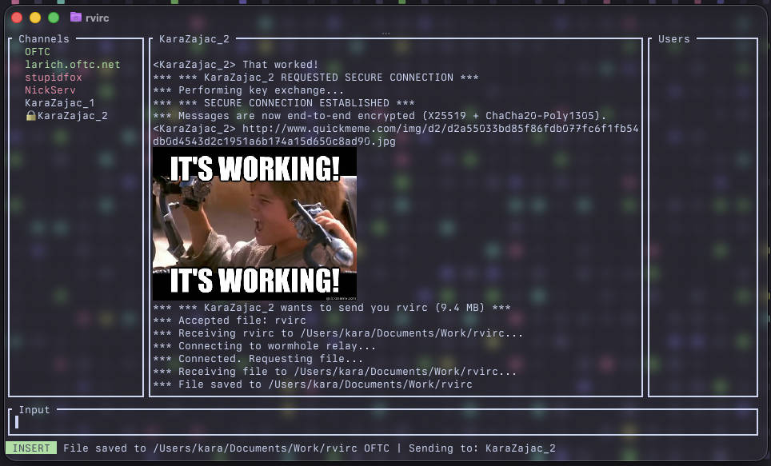

# rvIRC

**Rust + VIM + IRC** — A terminal IRC client with vim-style modes and commands, built with [ratatui](https://ratatui.rs/) and the [irc](https://crates.io/crates/irc) crate.



## Requirements

- **Rust** (latest stable): <https://rustup.rs/>

## Features

- **Vim-style modes**: NORMAL, INSERT, COMMAND with distinct status bar colors (blue, green, orange).
- **Commands**: `:connect`, `:servers`, `:join`, `:list`, `:part`, `:msg`, `:quit`, and more (see below).
- **Panes**: Channels (left) and users (right). Toggle with `c` / `u`; j/k or arrows + Enter to switch channel or open user actions (DM, whois, etc.).
- **Config**: `~/.config/rvIRC/config.toml` — multiple servers, nickname, optional NickServ identify and auto-join. Connect order: connect → identify with NickServ (if set) → then auto-join channels.
- **Auto-reconnect**: After an unexpected disconnect, the client retries up to 3 times (5s, 15s, 30s). Manual `:connect` or `:quit` cancels auto-reconnect.
- **Encrypted DMs**: Two rvIRC clients can establish an end-to-end encrypted DM session using `:secure` (or `:secure <nick>`). Uses fresh ephemeral X25519 key exchange per session + ChaCha20-Poly1305 with directional keys (no nonce reuse). A green lock icon appears in the channel list next to secure sessions; a checkmark appears when the peer is verified. Incoming requests show an accept/reject popup. Persistent identity keys are stored in `~/.config/rvIRC/identity.toml`. Trust on First Use (TOFU) key tracking warns if a peer's identity key changes. Optional SAS verification via `:verify` / `:verified`.
- **File Transfer**: Send files between rvIRC clients using `:sendfile` (opens a file browser) or `:sendfile <nick> <path>`. Uses [magic-wormhole](https://crates.io/crates/magic-wormhole) for secure relay-based file transfer. The recipient gets a popup to accept or reject the file. In-chat status messages track transfer progress.
- **Message area**: Long messages wrap to the pane width. The view auto-scrolls to the bottom when new messages arrive (scroll up with k/j or Page Up/Down to read history). Links that end in an image extension (e.g. `.png`, `.jpg`, `.gif`) are fetched and displayed inline in the chat using [ratatui-image](https://crates.io/crates/ratatui-image) when your terminal supports it (e.g. Sixel, Kitty, iTerm2); this works in channels, DMs, and encrypted DMs. Animated GIFs are fully animated: frames are pre-encoded when loaded, and only GIFs visible on screen animate (off-screen ones stay paused to save CPU).
- **IRC formatting**: Messages support bold, italic, strikethrough, and colors. Use `*italic*`, `**bold**`, `***bold italic***`, `~~strikethrough~~`, `||spoiler||` (rendered dim), and `:colorname: text :colorname:` for colors (e.g. `:blue:`, `:red:`, `:green:`). Use `:normal:` to reset formatting (e.g. `:red: red :normal: back to default`). Compatible with [IRC format codes](https://modern.ircdocs.horse/formatting).
- **rvIRC effects** (sent as literal text; only rvIRC displays them): `@@text@@` = animated rainbow (cycles colors). `$$text$$` = scared (randomly flickers between normal, white, black, grey, bold).

## Build & run

```bash
cargo build --release
./target/release/rvirc
```

## Commands

Type `:` to enter COMMAND mode, then run any of these (case-insensitive):

| Command | Description |
|--------|-------------|
| `connect <name>` / `server <name>` | Connect to a server by config name |
| `servers` | Show server list from config; pick one to connect |
| `reconnect` | Reconnect to the current server |
| `join #channel [key]` | Join a channel (`#` added if omitted); optional key for keyed channels |
| `part` / `leave` | Part current channel or close current DM; `part #chan` parts a channel, `part nick` closes a DM window |
| `list` | Fetch and show channel list (popup); type to filter, Enter to join |
| `msg <nick> <text>` / `query` | Send a private message |
| `me <action text>` | Send an action (/me) to the current channel or DM |
| `nick <newnick>` | Change your nickname |
| `topic` | Show current channel topic; `topic <text>` to set it (if op) |
| `whois [nick]` | Show whois info; omit nick to use current DM window |
| `kick [channel] <nick> [reason]` | Kick user from channel |
| `ban [channel] <mask>` | Set ban mask on channel (e.g. `*!*@host` or `nick!*@*`) |
| `channel #chan` / `chan` / `c #chan` | Switch to channel/DM by name |
| `quit` / `exit` / `q` | Disconnect and quit |
| `channel-panel show` / `hide` | Show or hide the channels pane (top left) |
| `messages-panel show` / `hide` | Show or hide the messages pane (bottom left) |
| `user-panel show` / `hide` | Show or hide the users pane (top right) |
| `friends-panel show` / `hide` | Show or hide the friends pane (bottom right) |
| `channels` / `messages` / `users` / `friends` | Focus the corresponding pane |
| `version` | Show version (1.0.0) in status bar |
| `credits` | Show credits popup (author and GitHub link) |
| `license` | Show license popup (full LICENSE text) |
| `secure [nick]` | Start an encrypted DM session (defaults to current DM) |
| `unsecure [nick]` | End an encrypted DM session (defaults to current DM) |
| `verify [nick]` | Display a 6-word verification code for the secure session (compare out-of-band) |
| `verified [nick]` | Mark the peer as verified after comparing verification codes |
| `sendfile [nick] [path]` | Send a file via magic wormhole; omit path to browse, omit nick to use current DM |

## Keybindings

### NORMAL mode

| Key | Action |
|-----|--------|
| `i` | Enter INSERT mode (type messages) |
| `:` | Enter COMMAND mode (run commands) |
| `c` | Focus channels pane |
| `m` | Focus messages pane |
| `u` | Focus users pane |
| `f` | Focus friends pane |
| `k` / `j` or ↑ / ↓ | Scroll message area (when focus on main) |
| Page Up / Page Down | Scroll message area by page |
| Esc | Unfocus side pane (back to main) |
| Ctrl+C | Quit app |

### INSERT / COMMAND mode

- Type your message or command; **Enter** to send, **Esc** to return to NORMAL.
- **↑ / ↓** — Input history (previous/next line).
- **Tab** — Complete `:command` names.

### Channels pane (when focused)

| Key | Action |
|-----|--------|
| `k` / `j` or ↑ / ↓ | Move selection |
| Enter | Switch to selected channel |
| `c` / Esc | Unfocus pane |

### Messages pane (when focused)

| Key | Action |
|-----|--------|
| `k` / `j` or ↑ / ↓ | Move selection |
| Enter | Switch to selected DM |
| `m` / Esc | Unfocus pane |

### Users pane (when focused)

| Key | Action |
|-----|--------|
| `k` / `j` or ↑ / ↓ | Move selection |
| Enter | Open user action menu (DM, Kick, Ban, Mute, Whois) |
| `u` / Esc | Unfocus pane |

User actions: **Kick** and **Ban** perform the IRC command (current channel). **Mute** hides that nick’s messages locally.

### Friends pane (when focused)

| Key | Action |
|-----|--------|
| `k` / `j` or ↑ / ↓ | Move selection |
| Enter | Open DM with selected friend |
| `f` / Esc | Unfocus pane |

Panels can be hidden independently with `:channel-panel hide`, `:messages-panel hide`, `:user-panel hide`, `:friends-panel hide`. When one pane on a side is hidden, the other takes the full height.

### Popups

- **:servers** — j/k or arrows to move, **Enter** to connect, **Esc** to close.
- **:list** — Type to filter; **Enter** to toggle “scroll mode” then j/k + Enter to join; **Esc** to close.
- **Whois** — **Esc** or **Enter** or **q** to close.
- **:credits** — **Esc** or **Enter** or **q** to close.
- **:license** — **j/k** or arrows / Page Up/Down to scroll; **Esc** or **Enter** or **q** to close.
- **Secure session request** — **y** / **Enter** to accept, **n** / **Esc** to reject. Shows a TOFU warning in red if the peer's identity key has changed.
- **File receive** — **y** / **Enter** to accept, **n** / **Esc** to reject.
- **File browser** (receive: choose save dir; send: choose file) — **j/k** or arrows to navigate, **Enter** to open directory (or select file when sending), **Backspace** to go up, **s** to save here (receive mode), **Esc** or **q** to cancel.

## Config

Config path: `~/.config/rvIRC/config.toml`. If missing, the app creates the directory and a default config with 0600 permissions on Unix. **Security**: config.toml can contain `identify_password` and server `password` — ensure it is not world-readable (e.g. `chmod 600 ~/.config/rvIRC/config.toml`). The same directory also stores:

- `identity.toml` — Your persistent X25519 identity keypair (auto-generated on first launch, 0600 permissions on Unix).
- `known_keys.toml` — TOFU key store tracking peer identity keys, verification status, and timestamps (0600 on Unix).

```toml
username = "myuser"
nickname = "mynick"
# alt_nick = "mynick_"   # optional: used if primary nick is in use (433)
real_name = "My Name"
# download_dir = "~/Downloads/"   # optional: default save directory for received files
# render_images = true            # optional: set to false to disable inline image display (default: true)

[[servers]]
name = "Libera"
host = "irc.libera.chat"
port = 6697
tls = true
# identify_password = "your_nickserv_password"   # optional: identify with NickServ after connect
# auto_connect = "yes"                          # optional: connect to this server on startup
# auto_join = "#rvirc, #rust"                    # optional: join these channels after identify

[[servers]]
name = "Hackint"
host = "irc.hackint.org"
port = 6697
tls = true

[[servers]]
name = "Local"
host = "127.0.0.1"
port = 6667
tls = false
```

Connect flow: connect to server → identify with NickServ (if `identify_password` is set) → then auto-join channels from `auto_join`.

The message area shows **channel topic** and **modes** (e.g. `+nt`) when available. Messages that **mention your nick** are highlighted. When someone **invites** you to a channel, the status line shows the invite and you can `:join #channel` to accept. The client replies to **CTCP** VERSION, PING, and TIME.

## Encrypted DMs

rvIRC supports end-to-end encrypted direct messages between rvIRC clients. This is an rvIRC-exclusive feature that works transparently over standard IRC.

### Workflow

1. Open a DM with the target user and run `:secure` (or `:secure <nick>` from anywhere)
2. A fresh ephemeral X25519 keypair is generated for this session
3. Both clients exchange ephemeral + identity public keys via hidden protocol messages
4. The recipient sees an accept/reject popup before completing the handshake
5. TOFU (Trust on First Use) checks the peer's identity key against `~/.config/rvIRC/known_keys.toml` -- a warning is shown if the key has changed since last session
6. In-chat status messages show the handshake progress, key fingerprints, and TOFU status
7. Once established, all messages in that DM are encrypted with ChaCha20-Poly1305 using directional keys (separate send/recv keys derived from the DH secret using HKDF with role-specific info strings, preventing nonce reuse)
8. A lock icon (🔒) appears next to the nick in the channels list; a checkmark (✔) appears if the peer is verified
9. Use `:verify` to display a 6-word verification code -- compare it out-of-band with your peer, then run `:verified` to mark them as trusted
10. Use `:unsecure` (or `:unsecure <nick>`) to end the encrypted session

### Security model

- **Persistent identity**: Your X25519 identity keypair is stored in `~/.config/rvIRC/identity.toml` (generated on first launch, permissions set to 0600 on Unix). This keypair is used for TOFU tracking and SAS verification, not for DH -- each session uses a fresh ephemeral keypair.
- **Directional keys**: The DH shared secret is expanded via HKDF-SHA256 into two independent keys (`rvIRC-dm-init` and `rvIRC-dm-resp`), assigned based on lexicographic ordering of the ephemeral public keys. Each side uses a different key to send, preventing (key, nonce) reuse.
- **TOFU**: Peer identity keys are recorded in `~/.config/rvIRC/known_keys.toml` with nick, server, fingerprint, verification status, and timestamps. On subsequent sessions, the client checks if the key matches. If it changed, a red warning is displayed and (for ACK) the handshake is blocked.
- **SAS verification**: `:verify` derives a 6-word Short Authenticated String from the shared DH secret + both identity public keys using HKDF. Both users should see the same 6 words if there is no MITM. After out-of-band comparison, run `:verified` to mark the peer as trusted in `known_keys.toml`.
- **Replay protection**: Received messages must arrive in strict order (monotonic nonce). Out-of-order IRC delivery (e.g. network splits, relays) can cause legitimate messages to be rejected. If you see repeated decrypt failures, run `:secure` again to re-key the session.

The key exchange and encrypted messages use `[:rvIRC:]`-prefixed protocol messages that are intercepted and never displayed to the user. Inline image display works in encrypted DMs as well.

## File Transfer

rvIRC clients can send files to each other using magic wormhole:

1. Sender runs `:sendfile <nick> /path/to/file`, or `:sendfile` in a DM to open a file browser
2. A wormhole code is generated and sent to the recipient via an rvIRC protocol message
3. In-chat status messages track the transfer progress (connection, sending, completion)
4. The recipient sees a popup: "nick wants to send you file.txt (1.2 MB). Accept?"
5. If accepted and `download_dir` is configured, the file is saved there directly
6. If `download_dir` is not set, a file browser popup lets the user choose a save directory
7. The file transfers securely via the magic wormhole relay

All five commands (`:secure`, `:unsecure`, `:verify`, `:verified`, `:sendfile`) default to the nick of the current DM window when no nick argument is given.

## License

See [LICENSE](LICENSE) for details.
